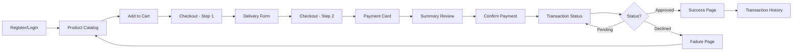

# 🛒 Checkout Commerce App

A modern, full-featured e-commerce checkout application built with React, TypeScript, and Redux Toolkit. This Single Page Application (SPA) provides a complete shopping experience with product browsing, cart management, secure payment processing via Wompi integration, and transaction tracking.

[](https://reactjs.org/)
[](https://www.typescriptlang.org/)
[](https://redux-toolkit.js.org/)
[](https://vitejs.dev/)
[](https://jestjs.io/)

## ✨ Features

### Core Functionality
- 🛍️ **Product Catalog**: Browse available products with real-time stock information
- 🛒 **Shopping Cart**: Add/remove items with automatic total calculation
- 📦 **Delivery Management**: Complete shipping address form with validation
- 💳 **Payment Processing**: Secure credit card payment with Wompi integration
- 🔄 **Transaction Tracking**: Real-time transaction status monitoring with polling
- 📜 **Transaction History**: View complete purchase history
- 🔐 **Authentication**: User login/registration system with JWT tokens

### Technical Highlights
- ⚡ **State Management**: Redux Toolkit with Flux architecture
- 💾 **State Persistence**: Redux Persist for resilient user sessions
- 🎨 **Responsive Design**: Mobile-first SASS styling with BEM methodology
- 🧪 **Test Coverage**: >80% code coverage with Jest & React Testing Library
- 🔍 **Form Validation**: Real-time validation for all user inputs
- 🎯 **Card Detection**: Automatic VISA/MasterCard detection and formatting
- 🔄 **Auto-polling**: Transaction status updates every 5 seconds
- 🌐 **API Integration**: RESTful API communication with Axios

## 🛠️ Technology Stack

### Frontend Framework
- **React 18.2.0** - Modern UI library with hooks and concurrent features
- **TypeScript 5.2.2** - Type-safe development with advanced type checking
- **Vite 5.0.8** - Lightning-fast build tool and dev server

### State Management
- **Redux Toolkit 2.0.1** - Simplified Redux with modern patterns
- **Redux Persist 6.0.0** - Persist and rehydrate Redux store
- **React Redux 9.0.4** - Official React bindings for Redux

### Routing & Navigation
- **React Router DOM 7.13.1** - Declarative routing for React applications

### Styling
- **SASS 1.69.5** - CSS preprocessor with advanced features
- **BEM Methodology** - Block Element Modifier naming convention
- **Mobile-First Design** - Responsive breakpoints for all devices

### Testing
- **Jest 29.7.0** - Delightful JavaScript testing framework
- **React Testing Library 14.1.2** - Testing utilities for React components
- **Jest DOM 6.1.5** - Custom jest matchers for DOM nodes

### HTTP Client
- **Axios 1.6.2** - Promise-based HTTP client for API requests

### Build & Development
- **Vite** - Fast development server with HMR
- **ESLint** - Code quality and consistency
- **TypeScript ESLint** - TypeScript-specific linting rules

## 🏗️ Architecture

This application follows industry best practices and modern React patterns:

### Flux Architecture
The app implements **Redux Toolkit's Flux pattern** with four main slices:
- **Auth Slice**: Handles authentication, JWT tokens, and user sessions
- **Products Slice**: Manages product catalog and inventory
- **Cart Slice**: Controls shopping cart items and calculations
- **Checkout Slice**: Orchestrates the checkout flow and transaction states

### State Persistence
Using **Redux Persist**, critical application state is automatically saved to localStorage:
- User authentication tokens
- Shopping cart contents
- Checkout progress
- Delivery information
- Form data (when appropriate)

This ensures users don't lose their progress on page refresh or accidental navigation.

### Component Architecture
- **Container/Presentation Pattern**: Separates logic from presentation
- **Colocation**: Each component includes its styles and tests in the same directory
- **Typed Hooks**: Custom `useAppDispatch` and `useAppSelector` for type safety
- **Async Thunks**: All API calls use Redux Toolkit's `createAsyncThunk`

## 📁 Project Structure

```
checkout-commerce-app/
├── 📄 index.html                      # HTML entry point
├── 📄 package.json                    # Dependencies and npm scripts
├── 📄 tsconfig.json                   # TypeScript configuration
├── 📄 tsconfig.node.json              # TypeScript config for Node
├── 📄 vite.config.ts                  # Vite bundler configuration
├── 📄 jest.config.ts                  # Jest testing configuration
├── 📄 .env                            # Environment variables
├── 📄 buildspec.yml                   # AWS CodeBuild configuration
├── 📄 amplify.yml                     # AWS Amplify configuration
│
└── 📁 src/                            # Source code directory
    │
    ├── 📄 main.tsx                    # Application entry point
    ├── 📄 App.tsx                     # Root component with routing
    ├── 📄 App.scss                    # Root component styles
    ├── 📄 setupTests.ts              # Jest setup configuration
    ├── 📄 vite-env.d.ts              # Vite type definitions
    │
    ├── 📁 features/                   # Redux slices (Flux pattern)
    │   ├── 📁 auth/
    │   │   └── authSlice.ts          # Authentication state management
    │   ├── 📁 products/
    │   │   └── productsSlice.ts      # Products catalog state
    │   ├── 📁 cart/
    │   │   └── cartSlice.ts          # Shopping cart state
    │   └── 📁 checkout/
    │       └── checkoutSlice.ts      # Checkout flow state
    │
    ├── 📁 store/                      # Redux store configuration
    │   ├── store.ts                  # Store setup + redux-persist
    │   └── hooks.ts                  # Typed Redux hooks
    │
    ├── 📁 pages/                      # Page-level components
    │   ├── 📁 ProductPage/
    │   │   ├── ProductPage.tsx       # Product catalog page
    │   │   ├── ProductPage.scss      # Page styles
    │   │   └── ProductPage.test.tsx  # Unit tests (>80% coverage)
    │   │
    │   ├── 📁 CheckoutPage/
    │   │   ├── CheckoutPage.tsx      # Multi-step checkout flow
    │   │   ├── CheckoutPage.scss     # Responsive styles
    │   │   └── CheckoutPage.test.tsx # Comprehensive tests
    │   │
    │   ├── 📁 LoginPage/
    │   │   ├── LoginPage.tsx         # User login form
    │   │   └── LoginPage.scss
    │   │
    │   ├── 📁 RegisterPage/
    │   │   ├── RegisterPage.tsx      # User registration form
    │   │   └── RegisterPage.scss
    │   │
    │   ├── 📁 TransactionStatusPage/
    │   │   ├── TransactionStatusPage.tsx  # Real-time status updates
    │   │   └── TransactionStatusPage.scss
    │   │
    │   └── 📁 TransactionHistoryPage/
    │       ├── TransactionHistoryPage.tsx # Purchase history
    │       └── TransactionHistoryPage.scss
    │
    ├── 📁 components/                 # Reusable components
    │   ├── 📁 Header/
    │   │   ├── Header.tsx            # Navigation header
    │   │   ├── Header.scss
    │   │   └── Header.test.tsx
    │   │
    │   ├── 📁 DeliveryForm/
    │   │   ├── DeliveryForm.tsx      # Shipping address form
    │   │   ├── DeliveryForm.scss
    │   │   └── DeliveryForm.test.tsx # 50+ test cases
    │   │
    │   ├── 📁 CreditCardModal/
    │   │   ├── CreditCardModal.tsx   # Payment card input modal
    │   │   ├── CreditCardModal.scss
    │   │   └── CreditCardModal.test.tsx # 80+ test cases
    │   │
    │   ├── 📁 PaymentSummaryBackdrop/
    │   │   ├── PaymentSummaryBackdrop.tsx # Order summary overlay
    │   │   ├── PaymentSummaryBackdrop.scss
    │   │   └── PaymentSummaryBackdrop.test.tsx
    │   │
    │   └── 📁 FinalStatus/
    │       ├── FinalStatus.tsx       # Payment result display
    │       ├── FinalStatus.scss
    │       └── FinalStatus.test.tsx
    │
    ├── 📁 config/                     # Configuration files
    │   ├── api.ts                    # API endpoints & keys
    │   └── 📁 __mocks__/
    │       └── api.ts                # Mocked API for tests
    │
    ├── 📁 types/                      # TypeScript type definitions
    │   └── index.ts                  # Global types & interfaces
    │
    └── 📁 styles/                     # Global styles
        ├── global.scss               # CSS reset & utilities
        └── _variables.scss           # SASS variables
```

## 🚀 Getting Started

### Prerequisites

Ensure you have the following installed:

- **Node.js** >= 18.x ([Download](https://nodejs.org/))
- **npm** >= 9.x (comes with Node.js) or **yarn** >= 1.22.x
- **Git** for version control

### Installation

1. **Clone the repository**
   ```bash
   git clone https://github.com/santiago2904/checkout-commerce-app.git
   cd checkout-commerce-app
   ```

2. **Install dependencies**
   ```bash
   npm install
   # or
   yarn install
   ```

3. **Configure environment variables**
   
   Create a `.env` file in the root directory:
   ```bash
   cp .env.example .env
   ```
   
   Update with your configuration:
   ```env
   # Wompi Sandbox Public Key
   VITE_WOMPI_PUBLIC_KEY=pub_stagtest_g2u0HQd3ZMh05hsSgTS2lUV8t3s4mOt7
   
   # Backend API Base URL
   VITE_CHECKOUT_API_URL=http://localhost:3000
   
   # Wompi API Base URL
   VITE_WOMPI_API_BASE_URL=https://api-sandbox.co.uat.wompi.dev/v1
   ```

4. **Start the development server**
   ```bash
   npm run dev
   ```
   
   The application will be available at `http://localhost:5173`

### Available Scripts

| Command | Description |
|---------|-------------|
| `npm run dev` | Start development server with hot reload |
| `npm run build` | Build for production (outputs to `dist/`) |
| `npm run preview` | Preview production build locally |
| `npm test` | Run all tests once |
| `npm run test:watch` | Run tests in watch mode |
| `npm run test:coverage` | Run tests with coverage report |
| `npm run lint` | Run ESLint to check code quality |

## ⚙️ Configuration

### API Configuration

The application connects to a backend API for payment processing. API configuration is centralized in [`src/config/api.ts`](src/config/api.ts).

#### Environment Variables

All environment variables must be prefixed with `VITE_` to be accessible in the application:

| Variable | Description | Default |
|----------|-------------|---------|
| `VITE_CHECKOUT_API_URL` | Backend API base URL | `http://localhost:3000` |
| `VITE_WOMPI_PUBLIC_KEY` | Wompi sandbox public key | Provided in `.env` |
| `VITE_WOMPI_API_BASE_URL` | Wompi API endpoint | `https://api-sandbox.co.uat.wompi.dev/v1` |

#### Backend API Endpoints

The backend must expose these RESTful endpoints:

| Method | Endpoint | Description |
|--------|----------|-------------|
| `POST` | `/api/auth/register` | Register new user account |
| `POST` | `/api/auth/login` | Authenticate user, return JWT token |
| `GET` | `/api/products` | Fetch product catalog with stock info |
| `GET` | `/api/checkout/acceptance-token` | Get Wompi acceptance token |
| `POST` | `/api/checkout` | Process payment transaction |
| `GET` | `/api/checkout/status/:wompiTransactionId` | Query transaction status |
| `GET` | `/api/checkout/transactions` | Get user's transaction history |

### Wompi Integration

This application integrates with **Wompi Payment Gateway** for secure credit card processing.

#### Card Detection Algorithm
- **VISA**: Card numbers starting with `4`
- **MasterCard**: Card numbers in ranges `51-55` or `2221-2720`

#### Test Cards (Sandbox)

Use these test cards in development:

| Card Number | Brand | Expiry | CVV | Expected Result |
|-------------|-------|--------|-----|-----------------|
| `4242424242424242` | VISA | Any future | Any 3 digits | Approved |
| `5425233430109903` | MasterCard | Any future | Any 3 digits | Approved |

### Redux DevTools

For development, install the [Redux DevTools Extension](https://github.com/reduxjs/redux-devtools):

- [Chrome Extension](https://chrome.google.com/webstore/detail/redux-devtools/lmhkpmbekcpmknklioeibfkpmmfibljd)
- [Firefox Extension](https://addons.mozilla.org/en-US/firefox/addon/reduxdevtools/)

This allows you to inspect Redux state, actions, and time-travel debug.

## 📱 Application Flow

### User Journey



### Complete Checkout Flow

#### 1. **Authentication** 
- Users can register or login with email/password
- JWT token stored in Redux and persisted in localStorage
- Protected routes require authentication

#### 2. **Product Catalog**
- Browse available products with images, descriptions, and pricing
- Real-time stock information displayed
- "Add to Cart" button disabled for out-of-stock items
- Products added to cart with single click

#### 3. **Checkout Process**

**Step 1: Delivery Information**
- Form fields: Full Name, Address, City, Postal Code, Phone Number
- Real-time validation:
  - Name: Minimum 3 characters
  - Address: Required field
  - Postal Code: Numeric format
  - Phone: Minimum 10 digits
- Data auto-saved to Redux store
- Can navigate back without losing data

**Step 2: Payment Information**
- Modal-based credit card input
- Automatic card type detection (VISA/MasterCard)
- Card number formatting (spaces every 4 digits)
- Expiration date validation (MM/YY format)
- CVV validation (3-4 digits)
- Visual card logos based on detection
- Keyboard shortcut: ESC to close modal

**Step 3: Order Summary**
- Review cart items and quantities
- Cost breakdown:
  - Subtotal
  - Delivery Fee
  - Base Transaction Fee
  - **Total Amount**
- Edit delivery or payment info before confirming
- "Confirm Payment" button triggers API call

#### 4. **Transaction Processing**
- POST request to `/api/checkout` endpoint
- Loading state with spinner
- Wompi payment gateway integration
- Automatic redirect to status page

#### 5. **Transaction Status**
- Real-time status polling (every 5 seconds)
- Status display with visual indicators:
  - 🔄 **PENDING**: Processing payment
  - ✅ **APPROVED**: Payment successful
  - ❌ **DECLINED**: Payment failed
- Transaction details shown (ID, amount, reference)
- Automatic polling stops on final status
- Navigation to transaction history or back to products

#### 6. **Transaction History**
- View all past transactions
- Filter and search capabilities (future enhancement)
- Transaction details include date, amount, status, products

## 🛣️ Routing

The application uses **React Router v6** for client-side routing:

| Route | Component | Description | Protected |
|-------|-----------|-------------|-----------|
| `/` | Redirect | Redirects to `/products` | No |
| `/register` | RegisterPage | User registration | No |
| `/login` | LoginPage | User authentication | No |
| `/products` | ProductPage | Product catalog | Yes |
| `/checkout` | CheckoutPage | Multi-step checkout | Yes |
| `/checkout/summary` | PaymentSummaryBackdrop | Order review | Yes |
| `/transaction/:id` | TransactionStatusPage | Status monitoring | Yes |
| `/transactions` | TransactionHistoryPage | Purchase history | Yes |

### Route Protection

Protected routes automatically redirect to `/login` if user is not authenticated. Authentication state is checked via Redux store.

## 🧪 Testing

This project follows **Test-Driven Development (TDD)** principles with comprehensive test coverage.

### Testing Strategy

- **Unit Tests**: Individual components and functions
- **Integration Tests**: Redux slice interactions
- **Component Tests**: User interactions and rendering
- **Coverage Target**: >80% for all metrics

### Running Tests

```bash
# Run all tests
npm test

# Watch mode (recommended during development)
npm run test:watch

# Generate coverage report
npm run test:coverage
```

### Coverage Report

After running `npm run test:coverage`, open the HTML report:

```bash
open coverage/lcov-report/index.html
```

### Test Files

Each component has a corresponding `.test.tsx` file:

```
src/
├── components/
│   ├── DeliveryForm/
│   │   └── DeliveryForm.test.tsx      # 50+ test cases
│   ├── CreditCardModal/
│   │   └── CreditCardModal.test.tsx    # 80+ test cases
│   └── Header/
│       └── Header.test.tsx
├── pages/
│   ├── ProductPage/
│   │   └── ProductPage.test.tsx        # 20+ test cases
│   └── CheckoutPage/
│       └── CheckoutPage.test.tsx       # 30+ test cases
```

### Example Test Cases

**DeliveryForm Tests:**
- Form renders with all fields
- Validates required fields
- Shows error messages
- Clears errors on correction
- Formats postal code correctly
- Validates phone number length
- Submits form with valid data
- Prevents submission with invalid data

**CreditCardModal Tests:**
- Modal opens/closes correctly
- Detects VISA cards (starts with 4)
- Detects MasterCard (51-55, 2221-2720)
- Formats card number with spaces
- Validates expiration date
- Validates CVV length
- Shows appropriate card logo
- Closes on ESC key press
- Prevents invalid characters

### Mocking

API calls are mocked in tests using `src/config/__mocks__/api.ts` to ensure tests run without external dependencies.

## � Styling & Design

### Design System

This application implements a **Mobile-First** responsive design approach using SASS/SCSS.

#### Breakpoints

| Device | Breakpoint | Base Width |
|--------|------------|------------|
| 📱 **Mobile** | `< 600px` | 375px (iPhone SE) |
| 📱 **Tablet** | `>= 600px` | 768px (iPad) |
| 💻 **Desktop** | `>= 960px` | 1200px+ |

#### Methodology

- **BEM (Block Element Modifier)**: Consistent class naming convention
- **Component-Scoped Styles**: Each component has its own `.scss` file
- **Global Variables**: Centralized in `src/styles/_variables.scss`
- **CSS Reset**: Standardized base styles in `src/styles/global.scss`

Example BEM structure:
```scss
.delivery-form { // Block
  &__field { // Element
    &--error { // Modifier
      border-color: red;
    }
  }
}
```

### Color Palette

```scss
// Primary Colors
$primary-color: #007bff;
$secondary-color: #6c757d;

// Status Colors
$success-color: #28a745;
$error-color: #dc3545;
$warning-color: #ffc107;
$info-color: #17a2b8;

// Neutral Colors
$background: #f8f9fa;
$border: #dee2e6;
$text-primary: #212529;
$text-secondary: #6c757d;
```

### Typography

- **Font Family**: System fonts for optimal performance
- **Base Size**: 16px (1rem)
- **Scale**: Modular scale for hierarchy
- **Line Height**: 1.5 for readability

## 🔐 State Management

### Redux Slices

#### Auth Slice (`features/auth/authSlice.ts`)

**State:**
```typescript
{
  user: User | null
  token: string | null
  loading: boolean
  error: string | null
}
```

**Actions:**
- `register(credentials)` - Register new user
- `login(credentials)` - Authenticate user
- `logout()` - Clear session
- `checkAuth()` - Verify token validity

#### Products Slice (`features/products/productsSlice.ts`)

**State:**
```typescript
{
  items: Product[]
  loading: boolean
  error: string | null
}
```

**Actions:**
- `fetchProducts()` - Load product catalog from API
- `updateStock(productId, quantity)` - Update stock after purchase

#### Cart Slice (`features/cart/cartSlice.ts`)

**State:**
```typescript
{
  items: CartItem[]
  deliveryInfo: ShippingAddress | null
  paymentInfo: CreditCard | null
  subtotal: number
  deliveryFee: number
  baseFee: number
  total: number
}
```

**Actions:**
- `addToCart(product)` - Add product to cart
- `removeFromCart(productId)` - Remove product
- `updateQuantity(productId, quantity)` - Change quantity
- `setDeliveryInfo(address)` - Save shipping address
- `setPaymentInfo(card)` - Save payment method
- `clearCart()` - Empty cart after purchase

#### Checkout Slice (`features/checkout/checkoutSlice.ts`)

**State:**
```typescript
{
  transactionId: string | null
  status: 'PENDING' | 'APPROVED' | 'DECLINED'
  loading: boolean
  error: string | null
  transactions: Transaction[]
}
```

**Actions:**
- `processCheckout(checkoutData)` - Submit payment
- `fetchTransactionStatus(id)` - Poll transaction status
- `fetchTransactionHistory()` - Get user's transactions
- `clearCheckout()` - Reset checkout state

### Redux Persist Configuration

```typescript
const persistConfig = {
  key: 'root',
  version: 1,
  storage,
  whitelist: ['auth', 'cart', 'checkout'] // Only persist these slices
}
```

This ensures critical data survives page refreshes while keeping the products slice fresh.

## 🔧 Development Notes

### Key Component Details

#### ProductPage
- Dispatches `fetchProducts()` on component mount
- Displays loading spinner during API call
- Shows error message if API fails
- Disables "Add to Cart" for out-of-stock items
- Clicking "Add to Cart" navigates to `/checkout`

#### CheckoutPage
- Multi-step wizard with visual step indicators
- Step 1: Delivery information form
- Step 2: Payment card modal
- Validates data before allowing progression
- Cart summary sidebar shows running total
- Redirects to `/products` if cart is empty
- Preserves data when navigating between steps

#### DeliveryForm
- **Real-time validation** on blur events
- **Error messages** appear below invalid fields
- **Format enforcement**:
  - Postal Code: Numeric only
  - Phone: Minimum 10 digits
  - Name: Minimum 3 characters
- **Auto-save**: Updates Redux store on change
- **Error recovery**: Clears error when user corrects input

#### CreditCardModal
- **Card type detection**:
  - Checks first digits of card number
  - VISA: Starts with 4
  - MasterCard: 51-55 or 2221-2720
- **Auto-formatting**:
  - Adds spaces every 4 digits
  - Max 19 digits (16 + 3 spaces)
- **Expiration validation**:
  - Format: MM/YY
  - Must be future date
  - Automatically adds slash
- **CVV validation**:
  - 3 digits for VISA
  - 3-4 digits for MasterCard
- **Security**: Card data NOT persisted to localStorage
- **Keyboard shortcuts**: ESC to close

#### TransactionStatusPage
- **Automatic polling**: Checks status every 5 seconds
- **Smart polling**: Stops when status is APPROVED or DECLINED
- **Visual feedback**: Different colors/icons for each status
- **Cleanup**: Clears polling interval on unmount
- **Error handling**: Shows user-friendly messages

### Error Handling

All API calls use try-catch with Redux Toolkit's async thunks:

```typescript
export const fetchProducts = createAsyncThunk(
  'products/fetch',
  async (_, { rejectWithValue }) => {
    try {
      const response = await axios.get('/api/products')
      return response.data
    } catch (error) {
      return rejectWithValue(error.response.data.message)
    }
  }
)
```

Errors are displayed to users through:
- Toast notifications (future enhancement)
- Inline error messages
- Error boundaries (future enhancement)

### Performance Optimizations

- **Code Splitting**: React.lazy() for route-based splitting (future)
- **Memoization**: useMemo/useCallback for expensive operations
- **Redux Selectors**: Reselect for derived state (future)
- **Image Optimization**: Lazy loading images (future)
- **Bundle Size**: Vite's tree-shaking reduces bundle size

## 📊 Type Definitions

Key TypeScript interfaces from `src/types/index.ts`:

```typescript
interface Product {
  id: string
  name: string
  description: string
  price: number
  stock: number
  imageUrl?: string
}

interface ShippingAddress {
  addressLine1: string
  city: string
  region: string
  country: string
  recipientName: string
  recipientPhone: string
}

interface CreditCard {
  number: string
  holderName: string
  expiryDate: string
  cvv: string
  cardType?: 'visa' | 'mastercard'
}

interface Transaction {
  transactionId: string
  wompiTransactionId: string
  status: 'PENDING' | 'APPROVED' | 'DECLINED'
  amount: number
  reference: string
  createdAt: string
}
```

See [`src/types/index.ts`](src/types/index.ts) for complete type definitions.

## 🚢 Deployment

### Building for Production

```bash
# Build optimized production bundle
npm run build

# Preview production build locally
npm run preview
```

The build output will be in the `dist/` directory.

### AWS Amplify Deployment

This project includes an `amplify.yml` configuration for AWS Amplify:

```yaml
version: 1
frontend:
  phases:
    preBuild:
      commands:
        - npm ci
    build:
      commands:
        - npm run build
  artifacts:
    baseDirectory: dist
    files:
      - '**/*'
  cache:
    paths:
      - node_modules/**/*
```

**Deploy to Amplify:**

1. Connect your GitHub repository to AWS Amplify
2. Select `main` branch for production
3. Amplify will automatically detect `amplify.yml`
4. Set environment variables in Amplify Console
5. Deploy

### AWS CodeBuild

Alternative deployment using `buildspec.yml` for AWS CodeBuild/CodePipeline.

### Environment Variables in Production

Ensure these are set in your deployment platform:

- `VITE_CHECKOUT_API_URL` - Your production API URL
- `VITE_WOMPI_PUBLIC_KEY` - Wompi production key (not sandbox)
- `VITE_WOMPI_API_BASE_URL` - Wompi production API URL

### Static File Hosting

The built application can be hosted on:
- **AWS S3 + CloudFront**
- **Netlify**
- **Vercel**
- **GitHub Pages**
- **Firebase Hosting**

All these platforms support SPA routing with proper configuration.

## 🌐 Browser Support

This application is tested and supported on:

| Browser | Version |
|---------|---------|
| Chrome | Last 2 versions |
| Firefox | Last 2 versions |
| Safari | Last 2 versions |
| Edge | Last 2 versions |
| Mobile Safari (iOS) | iOS 12+ |
| Chrome Mobile (Android) | Android 6+ |

> **Note:** Internet Explorer is not supported. The app uses modern JavaScript features (ES6+) and CSS properties.

## 🐛 Troubleshooting

### Common Issues

**Issue:** `npm install` fails with node-gyp errors
```bash
# Solution: Update Node.js to version 18+
nvm install 18
nvm use 18
```

**Issue:** Vite server won't start / Port 5173 already in use
```bash
# Solution: Kill the process or use a different port
npx kill-port 5173
# or
npm run dev -- --port 3001
```

**Issue:** Redux state not persisting
```bash
# Solution: Clear browser localStorage
# Open DevTools > Application > Local Storage > Clear All
```

**Issue:** API calls fail with CORS errors
```bash
# Solution: Ensure backend has CORS enabled for your frontend URL
# Backend should include CORS middleware:
# app.use(cors({ origin: 'http://localhost:5173' }))
```

**Issue:** Tests fail with "cannot find module" errors
```bash
# Solution: Clear Jest cache
npm test -- --clearCache
# Then reinstall dependencies
rm -rf node_modules package-lock.json
npm install
```

**Issue:** Types not recognized in TypeScript
```bash
# Solution: Restart TypeScript server in VSCode
# Command Palette (Cmd+Shift+P) > "TypeScript: Restart TS Server"
```

### Debug Mode

Enable verbose logging in development:

```typescript
// Add to src/store/store.ts
const store = configureStore({
  reducer: persistedReducer,
  middleware: (getDefaultMiddleware) =>
    getDefaultMiddleware({
      serializableCheck: {
        ignoredActions: [FLUSH, REHYDRATE, PAUSE, PERSIST, PURGE, REGISTER],
      },
    }),
  devTools: process.env.NODE_ENV !== 'production', // Enable Redux DevTools
})
```

### Getting Help

- Check existing [GitHub Issues](https://github.com/santiago2904/checkout-commerce-app/issues)
- Create a new issue with detailed reproduction steps
- Include browser console logs and network requests

## 📚 Learn More

### Technologies Used

- [React Documentation](https://react.dev/) - Learn React fundamentals
- [Redux Toolkit Tutorial](https://redux-toolkit.js.org/tutorials/quick-start) - Redux state management
- [React Router Guide](https://reactrouter.com/) - Client-side routing
- [Vite Guide](https://vitejs.dev/guide/) - Build tool and dev server
- [TypeScript Handbook](https://www.typescriptlang.org/docs/) - TypeScript language
- [SASS Documentation](https://sass-lang.com/documentation) - CSS preprocessing
- [Jest Documentation](https://jestjs.io/docs/getting-started) - Testing framework
- [Testing Library](https://testing-library.com/docs/react-testing-library/intro/) - React testing utilities

### Project Resources

- [Wompi API Documentation](https://docs.wompi.co/) - Payment gateway integration
- [Flux Architecture](https://facebook.github.io/flux/) - Application architecture pattern
- [BEM Methodology](http://getbem.com/) - CSS naming convention

## 🤝 Contributing

Contributions, issues, and feature requests are welcome!

### Development Workflow

1. **Fork the repository**
   ```bash
   # Click "Fork" button on GitHub
   ```

2. **Clone your fork**
   ```bash
   git clone https://github.com/YOUR_USERNAME/checkout-commerce-app.git
   cd checkout-commerce-app
   ```

3. **Create a feature branch**
   ```bash
   git checkout -b feature/amazing-feature
   ```

4. **Make your changes**
   - Write code following project conventions
   - Add tests for new features
   - Update documentation as needed
   - Ensure tests pass: `npm test`
   - Check linting: `npm run lint`

5. **Commit your changes**
   ```bash
   git add .
   git commit -m "feat: add amazing feature"
   ```
   
   Use [Conventional Commits](https://www.conventionalcommits.org/):
   - `feat:` - New feature
   - `fix:` - Bug fix
   - `docs:` - Documentation only
   - `style:` - Code style (formatting, no logic change)
   - `refactor:` - Code refactoring
   - `test:` - Adding or updating tests
   - `chore:` - Maintenance tasks

6. **Push to your fork**
   ```bash
   git push origin feature/amazing-feature
   ```

7. **Open a Pull Request**
   - Go to the original repository
   - Click "New Pull Request"
   - Select your feature branch
   - Describe your changes clearly

### Code Standards

- **TypeScript**: Use strict type checking
- **Component Structure**: Functional components with hooks
- **Styling**: SASS with BEM methodology
- **Testing**: Write tests for all new features
- **Documentation**: Update README and inline comments
- **Commits**: Follow Conventional Commits specification

### Running Quality Checks

```bash
# Type checking
npx tsc --noEmit

# Linting
npm run lint

# Tests with coverage
npm run test:coverage

# Build check
npm run build
```

## 🎯 Roadmap

### Future Enhancements

- [ ] **Multiple Payment Methods**: Add support for PSE, Nequi, Bancolombia QR
- [ ] **Order Tracking**: Real-time delivery status tracking
- [ ] **Product Search**: Full-text search with filters
- [ ] **Product Categories**: Browse by category and tags
- [ ] **Wishlists**: Save products for later
- [ ] **Reviews & Ratings**: User feedback on products
- [ ] **Discount Codes**: Promo code system
- [ ] **Multi-language**: i18n support (Spanish/English)
- [ ] **Email Notifications**: Order confirmations and updates
- [ ] **Admin Dashboard**: Manage products and orders
- [ ] **Analytics**: User behavior tracking
- [ ] **PWA Support**: Install as mobile app
- [ ] **Dark Mode**: Theme switching capability

## 📄 License

This project is licensed under the **MIT License** - see the [LICENSE](LICENSE) file for details.

```
MIT License

Copyright (c) 2026 Santiago Palacio

Permission is hereby granted, free of charge, to any person obtaining a copy
of this software and associated documentation files (the "Software"), to deal
in the Software without restriction, including without limitation the rights
to use, copy, modify, merge, publish, distribute, sublicense, and/or sell
copies of the Software, and to permit persons to whom the Software is
furnished to do so, subject to the following conditions:

The above copyright notice and this permission notice shall be included in all
copies or substantial portions of the Software.

THE SOFTWARE IS PROVIDED "AS IS", WITHOUT WARRANTY OF ANY KIND, EXPRESS OR
IMPLIED, INCLUDING BUT NOT LIMITED TO THE WARRANTIES OF MERCHANTABILITY,
FITNESS FOR A PARTICULAR PURPOSE AND NONINFRINGEMENT. IN NO EVENT SHALL THE
AUTHORS OR COPYRIGHT HOLDERS BE LIABLE FOR ANY CLAIM, DAMAGES OR OTHER
LIABILITY, WHETHER IN AN ACTION OF CONTRACT, TORT OR OTHERWISE, ARISING FROM,
OUT OF OR IN CONNECTION WITH THE SOFTWARE OR THE USE OR OTHER DEALINGS IN THE
SOFTWARE.
```

## 👤 Author

**Santiago Palacio**

- GitHub: [@santiago2904](https://github.com/santiago2904)
- LinkedIn: [Santiago Palacio](https://www.linkedin.com/in/santiago-palacio/)

## 🙏 Acknowledgments

- **React Team** for the amazing framework
- **Redux Team** for Redux Toolkit
- **Wompi** for payment gateway services
- **Vite Team** for the blazing-fast build tool
- **Testing Library** maintainers for excellent testing utilities
- All contributors who help improve this project

## 📊 Project Statistics

```bash
# Count lines of code (excluding node_modules and coverage)
find src -name '*.tsx' -o -name '*.ts' -o -name '*.scss' | xargs wc -l
```

**Approximate Stats:**
- **Components**: 8+
- **Pages**: 6
- **Redux Slices**: 4
- **Test Files**: 10+
- **Test Cases**: 200+
- **Code Coverage**: >80%

---

<div align="center">

**Built with ❤️ using React, TypeScript, and Redux Toolkit**

⭐️ **Star this repo if you find it helpful!** ⭐️

[Report Bug](https://github.com/santiago2904/checkout-commerce-app/issues) · 
[Request Feature](https://github.com/santiago2904/checkout-commerce-app/issues) · 
[Documentation](https://github.com/santiago2904/checkout-commerce-app/wiki)

</div>

